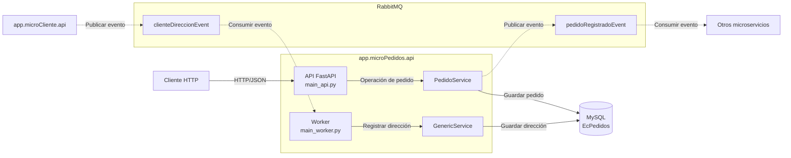
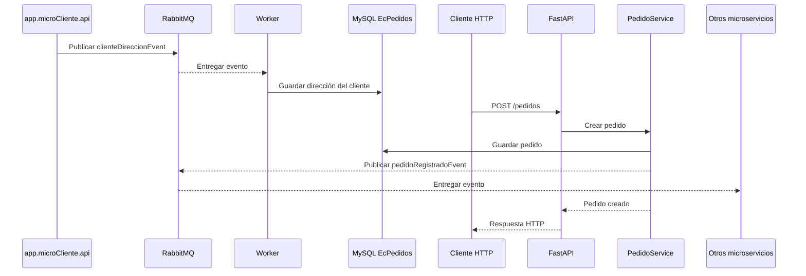

# Arquitectura de `app.microPedidos.api`

`app.microPedidos.api` es un microservicio de pedidos desarrollado con **Python**, **FastAPI**, **SQLAlchemy**, **MySQL** y **RabbitMQ**.

La aplicación tiene dos puntos de entrada que se ejecutan como procesos independientes:

- `main_api.py`: API HTTP para administrar pedidos.
- `main_worker.py`: worker que consume eventos de direcciones de clientes.

Ambos procesos comparten los servicios, los modelos y la base de datos MySQL `EcPedidos`.

## Diagrama de arquitectura



Las flechas continuas representan llamadas directas mediante HTTP o acceso a base de datos. Las flechas discontinuas representan comunicación asíncrona mediante eventos de RabbitMQ.

## Punto de entrada API

El archivo `main_api.py` inicia la aplicación FastAPI:

```powershell
uvicorn main_api:app --host 0.0.0.0 --port 8000
```

Su flujo principal es:

```text
Cliente HTTP
    → FastAPI
    → PedidoService
    → MySQL
    → pedidoRegistradoEvent
```

1. Un cliente envía una solicitud HTTP a la API.
2. FastAPI recibe y valida la operación.
3. La API delega la operación a `PedidoService`.
4. `PedidoService` guarda el pedido en MySQL.
5. Al registrar un pedido, el servicio publica `pedidoRegistradoEvent` en RabbitMQ.
6. Otros microservicios pueden consumir ese evento y continuar el procesamiento.

## Punto de entrada worker

El archivo `main_worker.py` inicia el consumidor de RabbitMQ:

```powershell
python main_worker.py
```

Su flujo principal es:

```text
app.microCliente.api
    → clienteDireccionEvent
    → Worker
    → GenericService
    → MySQL
```

1. `app.microCliente.api` publica `clienteDireccionEvent` en RabbitMQ.
2. El worker de pedidos permanece escuchando esa cola.
3. El worker recibe y transforma los datos de la dirección.
4. El worker delega la persistencia a `GenericService`.
5. `GenericService` guarda la dirección del cliente en MySQL.
6. La dirección queda disponible para asociarla posteriormente con un pedido.

## Componentes principales

| Componente | Responsabilidad |
|---|---|
| Cliente HTTP | Consume los endpoints de pedidos |
| API FastAPI | Recibe y valida solicitudes HTTP |
| `PedidoService` | Administra pedidos y publica eventos |
| Worker | Consume eventos de direcciones |
| `GenericService` | Ejecuta operaciones de persistencia |
| MySQL `EcPedidos` | Almacena pedidos y direcciones de clientes |
| RabbitMQ | Comunica los microservicios de manera asíncrona |
| `app.microCliente.api` | Publica las direcciones de clientes |
| Otros microservicios | Consumen eventos de pedidos registrados |

## Eventos

### `clienteDireccionEvent`

Evento de entrada producido por `app.microCliente.api` y consumido por el worker.

```json
{
  "ClienteId": 10,
  "NombreCompleto": "Juan Pérez",
  "Email": "juan@example.com",
  "DireccionCompleta": "Av. Amazonas, Quito"
}
```

El worker transforma el mensaje y almacena la dirección en la tabla `cliente_direcciones`.

### `pedidoRegistradoEvent`

Evento de salida producido por `PedidoService` después de guardar un pedido.

```json
{
  "id": 1,
  "direccion_cliente_id": 10,
  "fecha_pedido": "2026-07-18 10:30:00",
  "total": 150.75
}
```

El evento queda disponible en RabbitMQ para otros microservicios consumidores.

## Flujo completo



El flujo distribuido permite que la dirección se sincronice de manera asíncrona desde `app.microCliente.api`. Posteriormente, la API registra un pedido utilizando esa dirección y publica un nuevo evento para que otros microservicios reaccionen al pedido creado.

